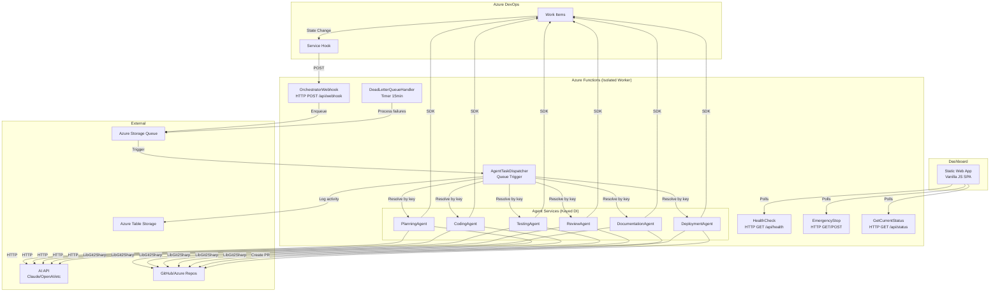
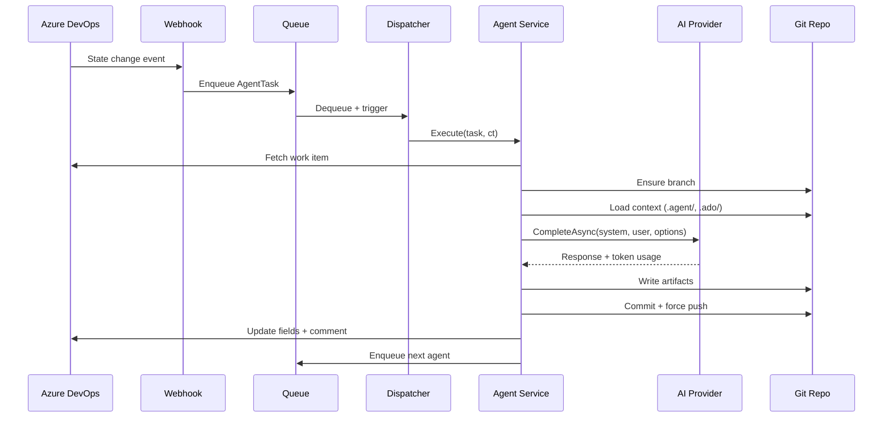

# Architecture

## System Architecture



## Component Relationships

### Core Library (`AIAgents.Core`)
Shared by all consumers. Contains:
- **Interfaces** — All service contracts (`IAIClient`, `IAzureDevOpsClient`, `IGitOperations`, etc.)
- **Models** — Domain objects shared across layers
- **Configuration** — `IOptions<T>` classes for all settings sections
- **Services** — Implementations of core operations (AI, Git, ADO, templates, validation)

### Functions App (`AIAgents.Functions`)
Azure-specific hosting layer. Contains:
- **Functions** — HTTP/Queue/Timer triggers (thin entry points)
- **Agents** — Workflow implementations (contain all prompt engineering)
- **Services** — Function-layer support (activity logging, task queue)

### Dependency Flow
```
Functions → Core (project reference)
Functions.Tests → Functions + Core (project references)
Core.Tests → Core (project reference)
```

## Data Flow

### Agent Pipeline


### State Management
Each story maintains state in `.ado/stories/US-{id}/state.json`:
```json
{
  "workItemId": 67,
  "currentState": "AI Code",
  "agents": {
    "Planning": { "status": "completed", "startedAt": "...", "completedAt": "..." }
  },
  "artifacts": { "codePaths": [], "testPaths": [], "docPaths": [] },
  "tokenUsage": { "agents": { "Planning": { "inputTokens": 1234, ... } } }
}
```

## Design Decisions

1. **Isolated worker model** over in-process: Better dependency isolation, .NET 8 support, independent lifecycle
2. **Queue-based dispatch** over direct HTTP calls: Automatic retry, poison queue handling, decoupled agents
3. **Keyed DI** for agent resolution: Clean dispatch without switch/case, easy to add new agents
4. **Force push on feature branches**: AI owns the entire branch — no merge conflicts, clean history
5. **Single HTTP client with resilience**: Circuit breaker + retry at transport level, not in each agent
6. **Per-agent AI model overrides**: Different models for different tasks (cheaper for docs, smarter for code)
7. **Error categorization**: Transient errors retry, config errors fail fast with clear messaging
8. **LibGit2Sharp** over CLI git: Type-safe, no shell dependency, better credential handling
9. **Scriban templates** for output formatting: Separates content from presentation for agent outputs
10. **Single-file dashboard**: No build step, no npm, instant deploy to Static Web Apps
