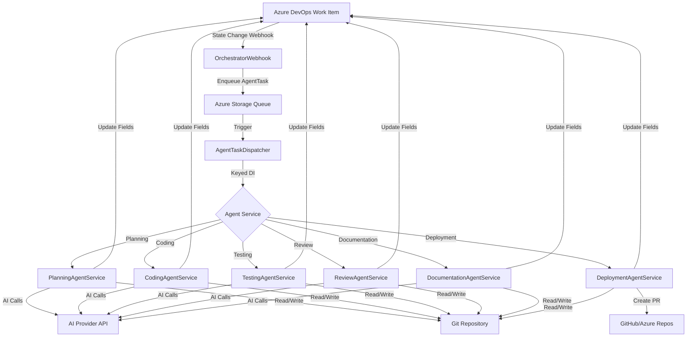

# ADO-Agent — Context Index

> Master reference for AI agents working on this codebase. Start here.

## Quick Reference

| Item | Value |
|------|-------|
| **Project** | AI Development Agents (ADO-Agent) |
| **Runtime** | .NET 8, Azure Functions v4 (isolated worker) |
| **Language** | C# 12, nullable enabled |
| **Solution** | `src/AIAgents.sln` (4 projects) |
| **Package Manager** | NuGet |
| **Test Framework** | xUnit 2.9.2 + Moq 4.20.72 |
| **Infrastructure** | Terraform (Azure) |
| **Dashboard** | Single-file SPA (vanilla JS) |
| **License** | MIT |

## Project Structure

```
ADO-Agent/
├── src/
│   ├── AIAgents.sln                    # Solution file (4 projects)
│   ├── AIAgents.Core/                  # Shared class library
│   │   ├── Configuration/              # IOptions<T> config classes (9 classes)
│   │   ├── Constants/                  # CustomFieldNames (ADO field refs)
│   │   ├── Interfaces/                 # Service contracts (10 interfaces)
│   │   ├── Models/                     # Domain models (16 classes)
│   │   ├── Services/                   # Core services (11 classes)
│   │   ├── Telemetry/                  # App Insights constants
│   │   └── Templates/                  # Scriban embedded resources (8 templates)
│   ├── AIAgents.Functions/             # Azure Functions app
│   │   ├── Program.cs                  # DI composition root
│   │   ├── host.json                   # Queue/timeout config
│   │   ├── Functions/                  # HTTP/Queue/Timer triggers (7 functions)
│   │   ├── Agents/                     # Agent implementations (7 agents)
│   │   ├── Services/                   # Function-layer services
│   │   └── Models/                     # Function-layer models
│   ├── AIAgents.Core.Tests/            # Core unit tests (8 files)
│   └── AIAgents.Functions.Tests/       # Function unit tests (12 files)
├── infrastructure/                     # Terraform IaC
│   ├── main.tf, variables.tf, outputs.tf
│   ├── functions.tf, storage.tf, static-web-app.tf, monitoring.tf
│   └── terraform.tfvars.example
├── dashboard/
│   ├── index.html                      # Single-file SPA (~1854 lines)
│   └── staticwebapp.config.json
└── .agent/                             # AI agent context docs (this folder)
```

## Architecture Overview



## Agent Pipeline States

```
New → Story Planning → AI Code → AI Test → AI Review → AI Docs → AI Deployment → Code Review / Ready for Deployment / Deployed
```

Each agent transitions the work item to the next state and enqueues the next agent automatically.

## Key Patterns

- **Keyed DI dispatch**: Agents registered as `IAgentService` with string keys, resolved by `AgentTaskDispatcher`
- **Error categorization**: `ErrorCategory` enum (Transient/Configuration/Data/Code) drives retry vs. fail behavior
- **IOptions<T> config**: All config via strongly-typed options classes bound from app settings
- **Per-agent AI models**: 4-level resolution chain (story per-agent → story tier → config per-agent → global)
- **State persistence**: `.ado/stories/US-{id}/state.json` in the repo tracks agent progress per story
- **Token tracking**: Per-agent usage accumulated in `StoryTokenUsage`, cost estimated via `TokenCostCalculator`
- **Force push on feature branches**: AI-owned branches (`feature/US-{id}`) use force push — safe by design
- **Structured JSON prompts**: All agents request JSON responses from AI, with markdown fence stripping + fallback parsing

## Files That Change Most

| Area | Files | When |
|------|-------|------|
| Agent logic | `src/AIAgents.Functions/Agents/*.cs` | Adding/modifying agent behavior |
| AI transport | `src/AIAgents.Core/Services/AIClient.cs` | New providers, API changes |
| ADO integration | `src/AIAgents.Core/Services/AzureDevOpsClient.cs` | New fields, state transitions |
| Git operations | `src/AIAgents.Core/Services/GitOperations.cs` | Branch/merge behavior |
| Config | `src/AIAgents.Core/Configuration/*.cs` | New settings |
| Dashboard | `dashboard/index.html` | UI changes |
| Infrastructure | `infrastructure/*.tf` | Azure resource changes |
