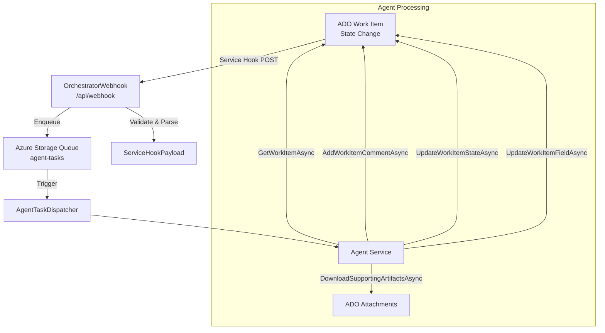

# Feature: Azure DevOps Integration

## Overview

ADOm8 integrates tightly with Azure DevOps (ADO) as the source of truth for work item state, triggering the agent pipeline via service hooks and reading/writing work item fields throughout. The integration covers: service hook webhooks, work item CRUD, state transitions, commenting, custom field management, and artifact attachment.

## Key Files

| File | Purpose |
|------|---------|
| `src/AIAgents.Core/Services/AzureDevOpsClient.cs` | Core ADO REST API client |
| `src/AIAgents.Core/Interfaces/IAzureDevOpsClient.cs` | Service contract |
| `src/AIAgents.Core/Configuration/AzureDevOpsOptions.cs` | Config: `OrganizationUrl`, `Project`, `Pat`, etc. |
| `src/AIAgents.Core/Constants/CustomFieldNames.cs` | ADO custom field reference names |
| `src/AIAgents.Core/Constants/AIPipelineNames.cs` | State/agent name constants |
| `src/AIAgents.Core/Models/StoryWorkItem.cs` | Domain model for a work item |
| `src/AIAgents.Functions/Functions/OrchestratorWebhook.cs` | HTTP webhook; entry point from ADO service hook |
| `src/AIAgents.Functions/Functions/ProvisionAzureDevOps.cs` | One-time setup: creates custom fields, service hooks |

## Architecture / Data Flow



## Configuration

Bound from `appsettings.json` / environment variables under the `AzureDevOps` section:

```json
{
  "AzureDevOps": {
    "OrganizationUrl": "https://dev.azure.com/myorg",
    "Project": "MyProject",
    "Pat": "<personal-access-token>",
    "WebhookSharedSecret": "<hmac-secret>"
  }
}
```

Config class: `src/AIAgents.Core/Configuration/AzureDevOpsOptions.cs`

## Custom Fields

Defined in `src/AIAgents.Core/Constants/CustomFieldNames.cs`. These fields must be provisioned in the ADO process template before the pipeline runs:

| Custom Field | Reference Name | Purpose |
|---|---|---|
| AI Autonomy Level | `Custom.AutonomyLevel` | 1–5 controls which agents run |
| Current AI Agent | `Custom.CurrentAIAgent` | Display: which agent is active |
| Last AI Agent | `Custom.LastAgent` | Display: last completed agent |
| AI Coding Provider | `Custom.AICodingProvider` | "Agentic" or "Copilot" override |
| Minimum Review Score | `Custom.MinimumReviewScore` | Threshold for auto-merge (autonomy 4+) |
| Story Model Tier | `Custom.StoryModelTier` | "Fast", "Balanced", "Smart" AI model tier |
| Planning Model | `Custom.PlanningModel` | Per-story model override for Planning |
| Coding Model | `Custom.CodingModel` | Per-story model override for Coding |
| Testing Model | `Custom.TestingModel` | Per-story model override for Testing |
| Review Model | `Custom.ReviewModel` | Per-story model override for Review |

## Service Hook Webhook

`OrchestratorWebhook` receives POST requests from ADO service hooks. The state machine that triggers the pipeline:

```
Work Item State → Agent Triggered
─────────────────────────────────
"AI Agent"          → Planning
"AI Code"           → Coding  (also handles "Story Planning" if re-triggered)
"AI Test"           → Testing
"AI Review"         → Review
"AI Docs"           → Documentation
"AI Deployment"     → Deployment
```

Webhook validation uses HMAC-SHA256 signature verification against `WebhookSharedSecret`. Input validation via `IInputValidator` guards against prompt injection and oversized payloads.

## Work Item Model

`StoryWorkItem` (`src/AIAgents.Core/Models/StoryWorkItem.cs`) is the domain model populated by `AzureDevOpsClient.GetWorkItemAsync`:

```csharp
public class StoryWorkItem
{
    public int Id { get; set; }
    public string Title { get; set; } = "";
    public string? Description { get; set; }
    public string? AcceptanceCriteria { get; set; }
    public string State { get; set; } = "";
    public int AutonomyLevel { get; set; }      // Custom.AutonomyLevel (default: 3)
    public int MinimumReviewScore { get; set; } // Custom.MinimumReviewScore (default: 70)
    public List<string> Tags { get; set; } = [];
    public DateTime CreatedDate { get; set; }
    // ... model override properties
}
```

## Supporting Artifacts (Attachments)

`AzureDevOpsClient.DownloadSupportingArtifactsAsync` downloads all ADO work item attachments (images, PDFs, etc.) into the story workspace at `.ado/stories/US-{id}/documents/`. These are materialized for the Planning agent to analyze before generating the implementation plan.

## ADO Provisioning

`ProvisionAzureDevOps` (`src/AIAgents.Functions/Functions/ProvisionAzureDevOps.cs`) is an HTTP-triggered function that creates all required custom fields and service hooks in one idempotent call. Call it once during initial setup:

```
POST /api/provision-ado
```

## How to Extend ADO Integration

1. **Add a new custom field**: Define the reference name in `CustomFieldNames.cs`, update `AzureDevOpsClient.GetWorkItemAsync` to read it, and map it to a property on `StoryWorkItem`.

2. **Handle a new ADO state**: Add the mapping in `OrchestratorWebhook.cs` where states are mapped to `AgentType` values.

3. **Update the ADO provision script**: Add the new field to `ProvisionAzureDevOps.cs` so it gets created automatically.

## Testing Approach

- `AzureDevOpsClient` is mocked via `IAzureDevOpsClient` in all agent tests.
- `WebhookPayloadParsingTests.cs` validates ADO service hook payload parsing.
- `WebhookContractTests.cs` validates the webhook HTTP contract.
- Integration tests in `src/AIAgents.Functions.Tests/Functions/` cover dispatch logic.
