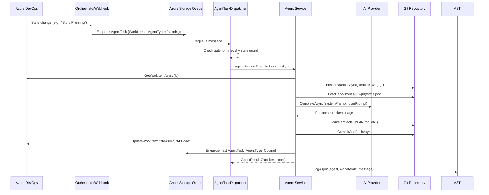

# Feature: Agent Pipeline

## Overview

The agent pipeline is the core orchestration engine of ADOm8. It processes Azure DevOps work items through a series of AI-powered agents, each responsible for a specific phase of the development lifecycle. Agents run sequentially, with each agent transitioning the work item state and enqueueing the next agent upon completion.

## Pipeline Stages

```
New → Story Planning → AI Code → AI Test → AI Review → AI Docs → AI Deployment → Code Review / Ready for Deployment / Deployed
```

The pipeline also supports two terminal error states:
- **Needs Revision** — Planning triage rejected the story (blockers found)
- **Agent Failed** — An agent encountered an unrecoverable error

## Key Files

| File | Purpose |
|------|---------|
| `src/AIAgents.Functions/Functions/AgentTaskDispatcher.cs` | Queue trigger; resolves and dispatches agents by key |
| `src/AIAgents.Functions/Functions/OrchestratorWebhook.cs` | HTTP webhook; receives ADO state change events, enqueues `AgentTask` |
| `src/AIAgents.Functions/Agents/PlanningAgentService.cs` | Triage + implementation plan |
| `src/AIAgents.Functions/Agents/CodingAgentService.cs` | Code generation (agentic or Copilot) |
| `src/AIAgents.Functions/Agents/TestingAgentService.cs` | Test generation |
| `src/AIAgents.Functions/Agents/ReviewAgentService.cs` | Code review + scoring |
| `src/AIAgents.Functions/Agents/DocumentationAgentService.cs` | Docs + PR creation |
| `src/AIAgents.Functions/Agents/DeploymentAgentService.cs` | Merge/deploy decisions |
| `src/AIAgents.Functions/Models/AgentTask.cs` | Queue message model |
| `src/AIAgents.Functions/Models/AgentType.cs` | Enum: Planning, Coding, Testing, Review, Documentation, Deployment, CodebaseDocumentation |
| `src/AIAgents.Functions/Models/AgentResult.cs` | Return value with success/fail, tokens, cost |
| `src/AIAgents.Functions/Models/ErrorCategory.cs` | Transient / Configuration / Data / Code |
| `src/AIAgents.Functions/Services/IAgentService.cs` | Agent contract: `ExecuteAsync(AgentTask, CancellationToken)` |
| `src/AIAgents.Functions/Services/IAgentTaskQueue.cs` | Queue abstraction |
| `src/AIAgents.Functions/Services/AgentTaskQueue.cs` | Azure Storage Queue implementation |
| `src/AIAgents.Core/Models/StoryState.cs` | Per-story persistent state |
| `src/AIAgents.Core/Models/AgentStatus.cs` | Per-agent status (pending/in_progress/completed) |

## Architecture / Data Flow



## Agent Registration (Keyed DI)

All agents are registered in `src/AIAgents.Functions/Program.cs` as keyed scoped services:

```csharp
services.AddKeyedScoped<IAgentService, PlanningAgentService>("Planning");
services.AddKeyedScoped<IAgentService, CodingAgentService>("Coding");
services.AddKeyedScoped<IAgentService, TestingAgentService>("Testing");
services.AddKeyedScoped<IAgentService, ReviewAgentService>("Review");
services.AddKeyedScoped<IAgentService, DocumentationAgentService>("Documentation");
services.AddKeyedScoped<IAgentService, DeploymentAgentService>("Deployment");
services.AddKeyedScoped<IAgentService, CodebaseDocumentationAgentService>("CodebaseDocumentation");
```

The dispatcher resolves the agent by key at runtime:
```csharp
var agentKey = agentTask.AgentType.ToString(); // e.g., "Planning"
var agentService = scope.ServiceProvider.GetRequiredKeyedService<IAgentService>(agentKey);
```

## Autonomy Levels

Configured via ADO custom field `Custom.AutonomyLevel`. Controls which agents run:

| Level | Name | Agents That Run |
|-------|------|----------------|
| 1 | Plan Only | Planning |
| 2 | Code Only | Planning, Coding |
| 3 | Review & Pause | Planning → Deployment (assigns human reviewer) |
| 4 | Auto-Merge | All agents, auto-merges if review score ≥ threshold |
| 5 | Full Autonomy | All agents, auto-merges + triggers deployment pipeline |

## Error Handling

Agents return `AgentResult` with an `ErrorCategory`:

```csharp
// Transient (rate limit, network) — for WI-backed tasks: fail fast + notify ADO
return AgentResult.Fail(ErrorCategory.Transient, "Rate limited", ex);

// Configuration (bad credentials) — permanent failure, comment on ADO
return AgentResult.Fail(ErrorCategory.Configuration, "Auth failed", ex);

// Code (unexpected exception) — permanent failure for WI tasks
return AgentResult.Fail(ErrorCategory.Code, $"Unexpected: {ex.Message}", ex);
```

The dispatcher catches these and calls `MarkWorkItemFailedAsync()` which:
1. Posts a formatted failure comment to the ADO work item
2. Sets `Custom.CurrentAIAgent` to the failing agent
3. Transitions work item to `"Agent Failed"` state

## State Persistence

Each story tracks progress in `.ado/stories/US-{id}/state.json` (committed to the feature branch):

```json
{
  "workItemId": 110,
  "currentState": "AI Code",
  "agents": {
    "Planning": { "status": "completed", "startedAt": "...", "completedAt": "..." },
    "Coding": { "status": "in_progress", "startedAt": "..." }
  },
  "artifacts": { "codePaths": [], "testPaths": [], "docPaths": [] },
  "tokenUsage": { "agents": { "Planning": { "inputTokens": 1234, "outputTokens": 567 } } },
  "decisions": [{ "agent": "Planning", "decisionText": "...", "rationale": "..." }]
}
```

## How to Add a New Agent

1. Create `src/AIAgents.Functions/Agents/MyNewAgentService.cs` implementing `IAgentService`:
   ```csharp
   public sealed class MyNewAgentService : IAgentService
   {
       public async Task<AgentResult> ExecuteAsync(AgentTask task, CancellationToken ct)
       {
           // ... implement agent logic
           return AgentResult.Ok(tokensUsed, costIncurred);
       }
   }
   ```

2. Add a value to `AgentType` enum in `src/AIAgents.Functions/Models/AgentType.cs`

3. Register in `src/AIAgents.Functions/Program.cs`:
   ```csharp
   services.AddKeyedScoped<IAgentService, MyNewAgentService>("MyNew");
   ```

4. Add state transition logic (update `AgentTaskDispatcher.ShouldSkipAgent` if needed)

5. Add tests in `src/AIAgents.Functions.Tests/Agents/MyNewAgentServiceTests.cs`

## Testing Approach

Each agent has a corresponding test file in `src/AIAgents.Functions.Tests/Agents/`. Tests use:
- **Moq** for mocking `IAIClient`, `IAzureDevOpsClient`, `IGitOperations`, etc.
- **xUnit** test runner
- `MockAIResponses` helper for pre-built AI response strings
- Pattern: `MethodName_Scenario_ExpectedResult`

See `src/AIAgents.Functions.Tests/Agents/PlanningAgentServiceTests.cs` for examples.
