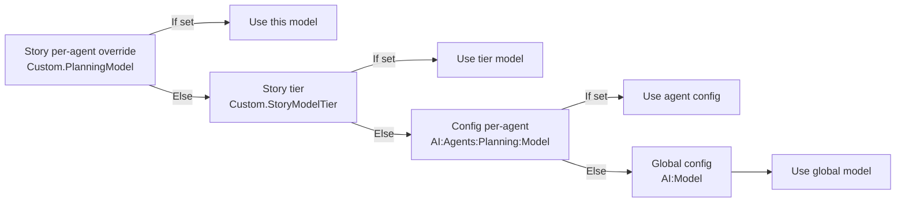
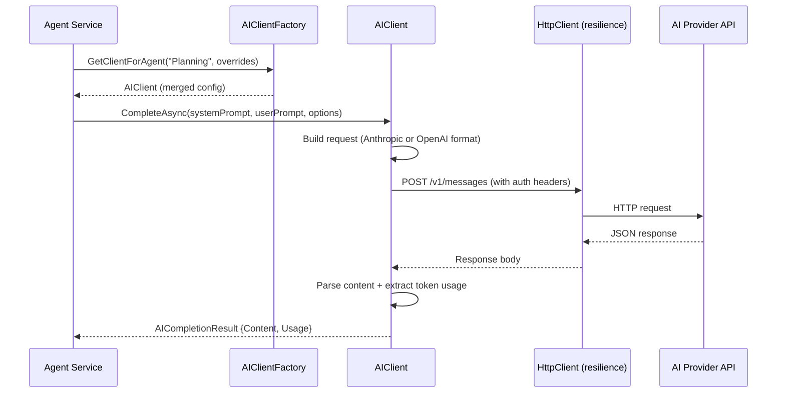

# Feature: AI Client

## Overview

The AI client provides a thin, transport-layer abstraction for calling AI provider APIs (Anthropic Claude and OpenAI-compatible endpoints). All prompt engineering lives in the agent services — this component handles only HTTP transport, request formatting, response parsing, token usage extraction, and resilience.

A factory pattern allows per-agent model overrides: each agent can use a different model, provider, or temperature without any changes to the core client.

## Key Files

| File | Purpose |
|------|---------|
| `src/AIAgents.Core/Services/AIClient.cs` | Main HTTP transport implementation |
| `src/AIAgents.Core/Services/AIClientFactory.cs` | Creates per-agent clients with merged config |
| `src/AIAgents.Core/Interfaces/IAIClient.cs` | Contract: `CompleteAsync(system, user, options, ct)` |
| `src/AIAgents.Core/Interfaces/IAIClientFactory.cs` | Factory contract: `GetClientForAgent(agentName, overrides?)` |
| `src/AIAgents.Core/Configuration/AIOptions.cs` | Config: Provider, ApiKey, Model, BaseUrl, MaxTokens, Temperature |
| `src/AIAgents.Core/Configuration/AgentAIProfile.cs` | Per-agent model config |
| `src/AIAgents.Core/Models/AICompletionResult.cs` | Response: Content, Usage (input/output tokens, estimated cost) |
| `src/AIAgents.Core/Models/TokenUsage.cs` | Token tracking model |
| `src/AIAgents.Functions/Program.cs` | HTTP client registration with resilience pipeline |

## Configuration

Bound from `appsettings.json` / environment variables under the `AI` section:

```json
{
  "AI": {
    "Provider": "Claude",
    "ApiKey": "<anthropic-or-openai-key>",
    "Model": "claude-opus-4-5",
    "BaseUrl": "https://api.anthropic.com/v1/messages",
    "MaxTokens": 8192,
    "Temperature": 0.3,
    "Agents": {
      "Planning": { "Model": "claude-opus-4-5" },
      "Coding":   { "Model": "claude-opus-4-5" },
      "Testing":  { "Model": "claude-haiku-3-5" },
      "Review":   { "Model": "claude-opus-4-5" },
      "Documentation": { "Model": "claude-haiku-3-5" }
    }
  }
}
```

## Provider Support

`AIClient` automatically detects the provider and formats requests accordingly:

| Provider | Detection | API Format |
|----------|-----------|------------|
| Anthropic (Claude) | `Provider == "Claude"` or `"Anthropic"` | Anthropic Messages API |
| OpenAI-compatible | Any other value | OpenAI Chat Completions API |

This means any OpenAI-compatible endpoint (Azure OpenAI, Ollama, LM Studio, etc.) works without code changes — just update `Provider`, `BaseUrl`, and `ApiKey`.

## Per-Agent Model Resolution (4-Level Chain)



This is implemented in `AIClientFactory.GetClientForAgent()`:
```csharp
var aiClient = _aiClientFactory.GetClientForAgent("Planning", workItem.GetModelOverrides());
```

## Resilience Pipeline

The HTTP client is configured with `AddStandardResilienceHandler` in `Program.cs`:

```csharp
services.AddHttpClient("AIClient")
    .AddStandardResilienceHandler(options =>
    {
        options.AttemptTimeout.Timeout = TimeSpan.FromSeconds(300);
        options.TotalRequestTimeout.Timeout = TimeSpan.FromMinutes(9);
        options.Retry.MaxRetryAttempts = 1;
        options.Retry.Delay = TimeSpan.FromSeconds(2);
        options.CircuitBreaker.BreakDuration = TimeSpan.FromSeconds(30);
        options.CircuitBreaker.FailureRatio = 0.8;
        options.CircuitBreaker.MinimumThroughput = 5;
    });
```

- **Retry**: 1 automatic retry with 2s delay (handles transient network issues)
- **Circuit breaker**: Opens after 80% failure rate over 5+ requests; stays open 30s
- **Timeouts**: 5 min per attempt, 9 min total (handles long AI completions)

## Token Tracking

Every `AICompletionResult` includes a `TokenUsage` object:
```csharp
public class AICompletionResult
{
    public string Content { get; set; } = "";
    public TokenUsage? Usage { get; set; }
}

public class TokenUsage
{
    public int InputTokens { get; set; }
    public int OutputTokens { get; set; }
    public int TotalTokens => InputTokens + OutputTokens;
    public decimal EstimatedCost { get; set; }
}
```

Each agent records usage in `StoryState.TokenUsage`:
```csharp
state.TokenUsage.RecordUsage("Planning", aiResult.Usage);
```

The dashboard displays accumulated token counts and estimated costs per agent.

## Data Flow



## How to Add a New AI Provider

1. Update `AIClient.cs` — add a new branch in the request builder (alongside the existing Claude/OpenAI branches).
2. Update `AIOptions.cs` if new config properties are needed.
3. Add a test case in `src/AIAgents.Core.Tests/Services/AIClientTests.cs`.

## Testing Approach

- `src/AIAgents.Core.Tests/Services/AIClientTests.cs` — tests request formatting, response parsing, token extraction for both Anthropic and OpenAI formats.
- `src/AIAgents.Core.Tests/Services/AIClientFactoryTests.cs` — tests the 4-level model resolution chain.
- All agent tests mock `IAIClient` directly via Moq; `MockAIResponses` in `src/AIAgents.Functions.Tests/Helpers/MockAIResponses.cs` provides pre-built JSON response strings for each agent type.
