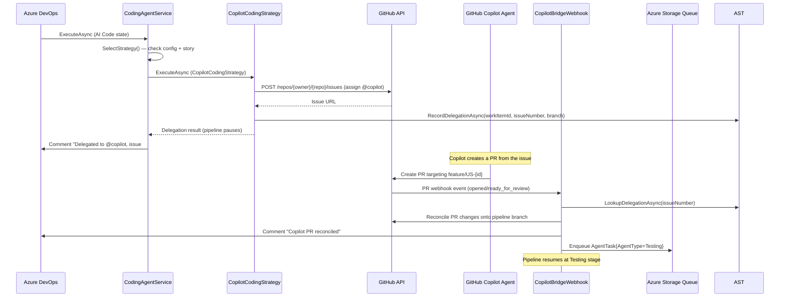

# Feature: GitHub Copilot Integration

## Overview

ADOm8 supports delegating coding work to **GitHub Copilot's coding agent** as an alternative to the built-in agentic coding strategy. When delegation is active, the pipeline pauses after the Coding agent enqueues a GitHub Issue assigned to `@copilot`. A separate webhook bridge catches Copilot's resulting PR, reconciles changes, and resumes the pipeline.

This feature enables the best-of-both-worlds approach: use the built-in agentic coder for simple stories, delegate complex ones to Copilot.

## Key Files

| File | Purpose |
|------|---------|
| `src/AIAgents.Functions/Agents/CodingAgentService.cs` | Orchestrates strategy selection (agentic vs. Copilot) |
| `src/AIAgents.Functions/Agents/CopilotCodingStrategy.cs` | Copilot delegation: creates GitHub Issue, tracks delegation |
| `src/AIAgents.Functions/Agents/AgenticCodingStrategy.cs` | Built-in multi-turn agentic coding (default path) |
| `src/AIAgents.Functions/Agents/ICodingStrategy.cs` | Strategy contract |
| `src/AIAgents.Functions/Functions/CopilotBridgeWebhook.cs` | Webhook: catches Copilot's PR, reconciles, resumes pipeline |
| `src/AIAgents.Functions/Functions/CopilotTimeoutChecker.cs` | Timer: detects Copilot timeout, falls back to agentic |
| `src/AIAgents.Functions/Services/CopilotDelegationService.cs` | Azure Table Storage tracking of active delegations |
| `src/AIAgents.Functions/Services/ICopilotDelegationService.cs` | Delegation service contract |
| `src/AIAgents.Core/Configuration/CopilotOptions.cs` | Config: Enabled, Mode, ComplexityThreshold, Model, etc. |
| `src/AIAgents.Core/Configuration/GitHubOptions.cs` | Config: Token, Owner, Repo |

## Architecture / Data Flow



## Strategy Selection Logic

`CodingAgentService` selects the strategy in priority order:

1. **Force-agentic flag** (set by `CopilotTimeoutChecker` when Copilot times out) → always use agentic
2. **ADO field `Custom.AICodingProvider`** = "Agentic" or "Copilot" → per-story override
3. **`Copilot:Mode` = "Always"** → always delegate to Copilot
4. **Complexity threshold**: stories ≥ `Copilot:ComplexityThreshold` story points → Copilot; else agentic
5. **Copilot disabled** (`Copilot:Enabled = false`) → always agentic

## Configuration

Bound under `Copilot` and `GitHub` sections:

```json
{
  "Copilot": {
    "Enabled": true,
    "Mode": "Threshold",
    "ComplexityThreshold": 8,
    "Model": "copilot",
    "TimeoutMinutes": 60
  },
  "GitHub": {
    "Token": "<github-pat>",
    "Owner": "myorg",
    "Repo": "myrepo"
  }
}
```

`Mode` options: `"Threshold"` (default), `"Always"`, `"Disabled"`

## Delegation Tracking

Active Copilot delegations are tracked in Azure Table Storage (`CopilotDelegations` table) via `ICopilotDelegationService`:

```csharp
// Record delegation when Coding agent sends to Copilot
await _delegationService.RecordDelegationAsync(workItemId, issueNumber, branchName, ct);

// Look up when bridge webhook receives a Copilot PR
var delegation = await _delegationService.LookupDelegationAsync(issueNumber, ct);

// Mark complete when bridge finishes reconciliation
await _delegationService.CompleteDelegationAsync(issueNumber, ct);
```

## Timeout Handling

`CopilotTimeoutChecker` is a timer-triggered function that runs every 15 minutes. It:
1. Queries for delegations older than `Copilot:TimeoutMinutes`
2. For timed-out delegations: sets force-agentic flag, re-enqueues the Coding agent
3. The Coding agent detects the force-agentic flag and runs the built-in agentic strategy

## Dashboard Display

The dashboard shows special cost display for Copilot-delegated stories:
- Cost column shows **"✦ 1 Premium Request"** instead of `$0.00`
- Agent card shows "Delegated to @copilot" status message
- Token count shows 0 (Copilot usage isn't directly tracked)

## How to Enable Copilot Integration

1. Create a GitHub PAT with `repo` scope and set `GitHub:Token`
2. Set `Copilot:Enabled = true` in app settings
3. Configure `Copilot:Mode` and `Copilot:ComplexityThreshold`
4. Set up a GitHub webhook pointing to `POST /api/copilot-bridge` for PR events

## Testing Approach

- `src/AIAgents.Functions.Tests/Agents/CopilotCodingStrategyTests.cs` — tests delegation flow with mocked GitHub API
- `src/AIAgents.Functions.Tests/Functions/CopilotBridgeWebhookTests.cs` — tests webhook bridge reconciliation
- `CodingAgentServiceTests.cs` covers strategy selection logic
- Use `ICopilotDelegationService` mock to control delegation lookup results
