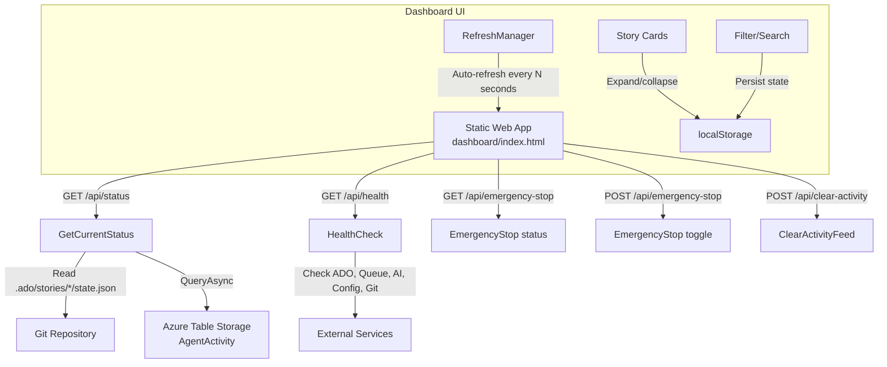

# Feature: Dashboard

## Overview

The ADOm8 dashboard is a single-file vanilla JS/HTML/CSS SPA located at `dashboard/index.html`. It provides real-time monitoring of the AI agent pipeline: story progress, agent statuses, token usage, cost tracking, health indicators, and activity feed. There is no build step — the file is deployed directly to Azure Static Web Apps.

## Key Files

| File | Purpose |
|------|---------|
| `dashboard/index.html` | Entire dashboard (~1850+ lines: HTML + CSS + JS in one file) |
| `dashboard/staticwebapp.config.json` | Azure Static Web Apps routing configuration |
| `.github/workflows/deploy-dashboard.yml` | CI/CD deployment workflow |
| `src/AIAgents.Functions/Functions/GetCurrentStatus.cs` | API: returns all story states for dashboard |
| `src/AIAgents.Functions/Functions/HealthCheck.cs` | API: returns system health status |
| `src/AIAgents.Functions/Functions/EmergencyStop.cs` | API: pause/resume pipeline processing |
| `src/AIAgents.Functions/Functions/ClearActivityFeed.cs` | API: clear activity log display |
| `src/AIAgents.Functions/Functions/ResetDashboard.cs` | API: reset dashboard state |
| `src/AIAgents.Functions/Models/DashboardStatus.cs` | Response model for `/api/status` |

## Architecture / Data Flow



## Key JavaScript Components

| Component/Function | Location | Purpose |
|---|---|---|
| `RefreshManager` class | ~line 2377 | Auto-refresh with configurable intervals (5/10/30/60s), pause/resume, countdown |
| `renderStoryCard()` | ~line 3497 | Renders individual story cards with agents |
| `renderAgentCard()` | ~line 3590 | Renders individual agent progress cards |
| `getStoryStatus()` | ~line 4028 | Determines overall story status from agent statuses |
| `calculateStoryProgress()` | ~line 4225 | Calculates % progress (completed + skipped / total) |
| `formatStatusText()` | ~line 3800 | Returns human-readable status text per agent |
| `getProgressColorClass()` | ~line 3697 | Maps progress % to CSS gradient class |
| `getAutonomyText()` | ~line 3408 | Maps autonomy level 1-5 to label |
| `hasCopilotUsage()` | ~line 4002 | Detects Copilot delegation for cost display |
| `toggleStoryCard()` | ~line 3761 | Expand/collapse with localStorage persistence |
| `handleSearchFilter()` | ~line 3771 | Search filter with localStorage persistence |
| `handleStatusFilter()` | ~line 3781 | Status dropdown filter with localStorage persistence |

## CSS Architecture

All styles are embedded in `<style>` tags within `dashboard/index.html`. Key CSS class patterns:

| Class | Purpose |
|---|---|
| `.story-card` | Collapsible story card wrapper |
| `.story-card-header` | Clickable header with expand/collapse |
| `.story-card-body` | Agent list (hidden when collapsed) |
| `.progress-red/orange/blue/green` | Gradient progress bar classes (0-25%, 26-50%, 51-75%, 76-100%) |
| `.sidebar-stats` | Sidebar section containers |
| `.top-nav` | Navigation bar (dark background #1e1e1e) |
| `[data-theme="dark"]` | Dark mode styles (default is light, dark mode toggle available) |

## Progress Bar Color Logic

```javascript
function getProgressColorClass(progress) {
    if (progress <= 25) return 'progress-red';
    if (progress <= 50) return 'progress-orange';
    if (progress <= 75) return 'progress-blue';
    return 'progress-green';
}
```

## Status Determination

`getStoryStatus()` treats `"skipped"` the same as `"completed"` — a story is complete when all agents are either completed or skipped:

```javascript
// A story is "completed" when all agents are completed or skipped
const allDone = agents.every(s => s === 'completed' || s === 'skipped');
```

## Cost Display (Copilot vs. Token Cost)

When a story uses GitHub Copilot delegation (`mode === 'copilot'` or `'copilot-delegated'`), the dashboard shows **"✦ 1 Premium Request"** instead of a dollar cost:

```javascript
function hasCopilotUsage(story) {
    return story.agents?.some(a => a.mode === 'copilot' || a.mode === 'copilot-delegated');
}
```

## Auto-Refresh System

`RefreshManager` handles all refresh lifecycle:
- **Intervals**: 5s, 10s, 30s, 60s (persisted to `localStorage`)
- **Pause/resume**: Stored in `localStorage` key `refresh-paused`
- **Countdown timer**: Visual countdown in the nav bar

## Health Indicators

Located in the sidebar under "System Health". Five indicators:
- **ADO** — Azure DevOps connectivity
- **Queue** — Azure Storage Queue health
- **AI** — AI provider API availability
- **Config** — Configuration validity
- **Git** — Git repository accessibility

Plus a **Poison Queue** counter showing dead-lettered messages.

## How to Add a UI Component to the Dashboard

1. Open `dashboard/index.html` (single file — all changes happen here)
2. **Add CSS** in the `<style>` section. Follow existing patterns:
   - Use CSS variables for colors
   - Support both light and dark mode with `[data-theme="dark"]` selectors
3. **Add HTML** in the appropriate section (nav, sidebar, main content)
4. **Add JavaScript** inline. Follow existing patterns:
   - Event listeners in `DOMContentLoaded`
   - State persisted to `localStorage` where appropriate
5. No build step — changes are immediately visible by opening the file in a browser

## Deployment

The dashboard deploys automatically via `.github/workflows/deploy-dashboard.yml` when `dashboard/index.html` changes on `main`. It deploys to Azure Static Web Apps.

## Testing Approach

No automated tests for the dashboard (single-file SPA, vanilla JS). Manual testing:
1. Open `dashboard/index.html` directly in a browser (file:// protocol)
2. Or deploy to any static host
3. Point `apiUrl` in the JS to your Azure Functions endpoint
4. Verify all story cards, agent statuses, health indicators, and refresh behavior
