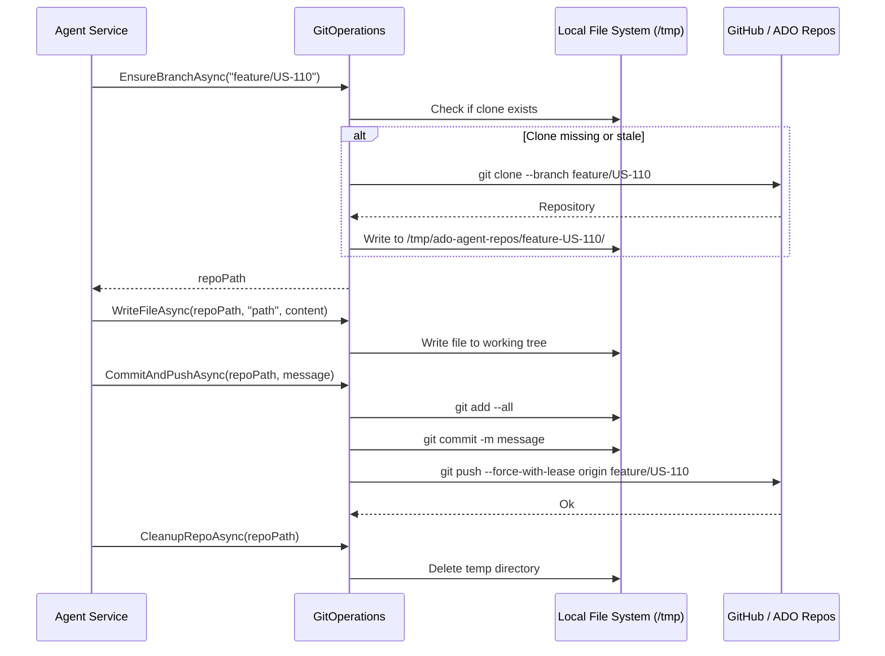

# Feature: Git Operations

## Overview

Git operations are handled by `GitOperations` using the **LibGit2Sharp** library — no shell process spawning, no `git` CLI dependency. This provides type-safe, credential-aware operations that work reliably inside Azure Functions' sandbox environment.

All agents use `IGitOperations` to clone/open repos, create feature branches, read and write files, commit, and push. Agents work on isolated branch-specific directories to avoid conflicts between concurrent runs.

## Key Files

| File | Purpose |
|------|---------|
| `src/AIAgents.Core/Services/GitOperations.cs` | LibGit2Sharp implementation |
| `src/AIAgents.Core/Interfaces/IGitOperations.cs` | Service contract |
| `src/AIAgents.Core/Configuration/GitOptions.cs` | Config: RepoUrl, Username, Token, LocalBasePath, Provider |
| `src/AIAgents.Core/Services/GitHubRepositoryProvider.cs` | GitHub PR/merge operations |
| `src/AIAgents.Core/Services/AzureDevOpsRepositoryProvider.cs` | ADO Repos PR/merge operations |
| `src/AIAgents.Core/Interfaces/IRepositoryProvider.cs` | PR/merge contract |
| `src/AIAgents.Functions/Program.cs` | Provider selection (GitHub vs ADO Repos) |

## Configuration

Bound from `appsettings.json` / environment variables under the `Git` section:

```json
{
  "Git": {
    "RepoUrl": "https://github.com/org/repo.git",
    "Username": "git-user",
    "Token": "<PAT-or-github-token>",
    "LocalBasePath": "/tmp/ado-agent-repos",
    "Provider": "GitHub"
  }
}
```

Set `Provider` to `"GitHub"` or `"AzureDevOps"` to select the repository provider for PR operations.

## Branch Naming Convention

All AI-owned feature branches follow the pattern `feature/US-{workItemId}`. These branches use **force push** — the AI agent owns the entire branch history and rewrites it on each run. This is intentional and safe: human code review happens via PR before merge, never directly on these branches.

## Core Operations

```csharp
// Open or clone repo, checkout branch (creates if needed)
string repoPath = await _gitOps.EnsureBranchAsync("feature/US-110", ct);

// Read a file from the working tree
string? content = await _gitOps.ReadFileAsync(repoPath, ".agent/CONTEXT_INDEX.md", ct);

// Write a file to the working tree
await _gitOps.WriteFileAsync(repoPath, ".agent/FEATURES/agent-pipeline.md", content, ct);

// Stage all changes + commit + force push
await _gitOps.CommitAndPushAsync(repoPath, "[AI Planning] US-110: Initialize docs", ct);

// List all tracked files (for context building)
IReadOnlyList<string> files = await _gitOps.ListFilesAsync(repoPath, ct);

// Delete a file from the working tree
await _gitOps.DeleteFileAsync(repoPath, "path/to/file.md", ct);

// Clean up temp clone dir after agent completes
await _gitOps.CleanupRepoAsync(repoPath, ct);
```

## Data Flow



## Disk Management

`EnsureBranchAsync` includes automatic disk space management to prevent exhaustion on Azure Functions Consumption plans:

1. **Stale sweep**: Removes any sibling clone directory older than 30 minutes.
2. **Emergency sweep**: If available disk space drops below 300 MB, removes ALL sibling clone directories (even recent ones) before proceeding with a new clone.

## Repository Provider (PR Operations)

`IRepositoryProvider` handles operations that are provider-specific (GitHub vs Azure DevOps Repos):

```csharp
// Create a pull request
var prId = await _repoProvider.CreatePullRequestAsync(
    title: "feat: US-110 codebase docs",
    body: "## Changes\n...",
    sourceBranch: "feature/US-110",
    targetBranch: "main",
    ct);

// Assign reviewer
await _repoProvider.AssignReviewerAsync(prId, "username", ct);

// Merge the PR
await _repoProvider.MergePullRequestAsync(prId, ct);
```

Provider is selected at startup based on `Git:Provider` config (see `Program.cs`).

## How to Extend Git Operations

1. **Add a new operation**: Add a method to `IGitOperations.cs`, implement in `GitOperations.cs` using LibGit2Sharp.
2. **Support a new Git host**: Implement `IRepositoryProvider` (see `GitHubRepositoryProvider.cs` as a template) and register it conditionally in `Program.cs`.

## Testing Approach

- `IGitOperations` is mocked via Moq in all agent tests.
- To test real Git behavior, consider integration tests with a local bare repository.
- Key mock setups:
  ```csharp
  _gitOps.Setup(g => g.EnsureBranchAsync(It.IsAny<string>(), It.IsAny<CancellationToken>()))
         .ReturnsAsync("/tmp/test-repo");
  _gitOps.Setup(g => g.ReadFileAsync("/tmp/test-repo", ".ado/stories/US-1/state.json", It.IsAny<CancellationToken>()))
         .ReturnsAsync(stateJson);
  ```
