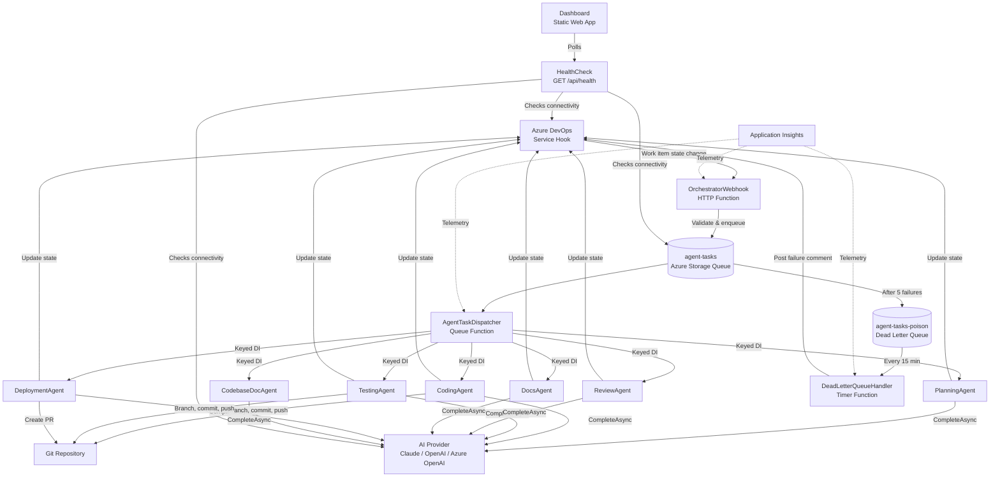
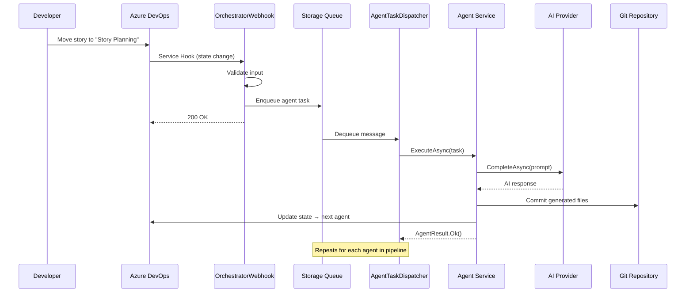
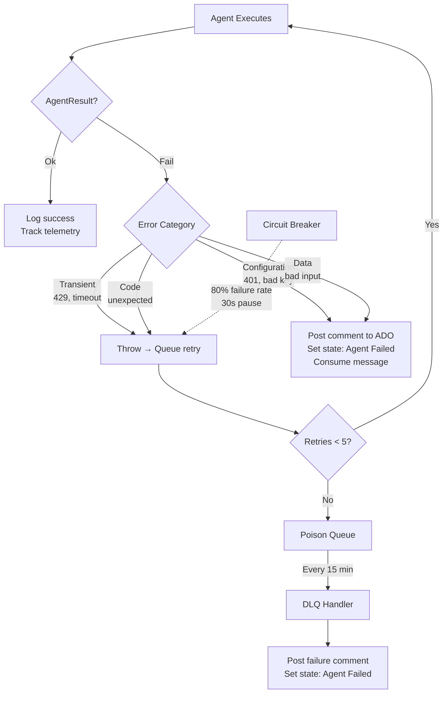

# ADOm8

ADOm8 is AI-powered development workflow automation for Azure DevOps. When a work item's state changes, autonomous AI agents analyze, code, test, review, and document the work — pushing changes to Git and advancing work items through the pipeline automatically.

Interactive onboarding guide: **https://adom8.dev/get-started**

## Getting Started

The preferred way to set up ADOm8 is using the automated Azure Pipeline. This pipeline provisions all necessary Azure infrastructure, configures your Azure DevOps project, and sets up the required GitHub integrations in a single run.

1. **[Pipeline Setup Guide (Recommended)](SETUP.md)** - Fast, automated setup using an Azure DevOps pipeline.
2. **[Manual Setup Guide](SETUP-MANUAL.md)** - Alternative setup using local PowerShell scripts or manual Terraform deployment.

## Architecture

```
Azure DevOps Service Hook (work item state change)
  → OrchestratorWebhook (HTTP Function — receives, queues, returns immediately)
    → "agent-tasks" Azure Storage Queue
      → AgentTaskDispatcher (Queue Function — single consumer)
        → Keyed IAgentService resolution (.NET 8 keyed DI)
          ├── PlanningAgent   → Analyzes story, creates technical plan
          ├── CodingAgent     → Generates code from plan
          ├── TestingAgent    → Generates unit tests
          ├── ReviewAgent     → Reviews code, assigns quality score
          └── DocsAgent       → Generates documentation
```

**State Machine:** `Story Planning` → `AI Code` → `AI Test` → `AI Review` → `AI Docs` → `Ready for QA`

### System Components



### Work Item Lifecycle



### Error Handling Flow



**Key Design Choices:**
- **Queue-based** — No HTTP timeouts, infinite scalability, automatic retry with poison queue
- **Single dispatcher** — Azure Storage Queues have no message filtering; one function dispatches via keyed DI
- **Thin AI client** — `IAIClient.CompleteAsync()` only; agents own their prompt engineering
- **Multi-provider** — Claude, OpenAI, or Azure OpenAI via configuration
- **Hybrid coding** — Coding agent uses a Strategy pattern: built-in agentic tool-use loop (default) or GitHub Copilot's coding agent for complex stories, configurable via `Copilot:Enabled`

## Quick Start

Estimated setup time: **10-15 minutes typical** using the automated Azure Pipeline.

### Prerequisites

- Azure subscription
- Azure DevOps organization with a project
- Claude or OpenAI API key
- GitHub Copilot (recommended for higher code quality and large codebase scans)

### Pipeline Setup (Recommended)

The preferred way to onboard ADOm8 is using the automated Azure Pipeline. This single pipeline provisions all Azure infrastructure, configures your ADO process, sets up GitHub webhooks, and securely stores all secrets in Azure Key Vault.

1. Create an **Onboarding PAT** in Azure DevOps (scopes: Process, Project and Team, Work Items, Code, Build, Release, Service Connections).
2. Create a **GitHub Token** scoped to your target repository.
3. Import `adom8-onboarding-pipeline.yml` into your Azure DevOps project.
4. Configure the required pipeline variables (see [SETUP.md](SETUP.md) for the full list).
5. Run the pipeline.

For detailed step-by-step instructions, see the [Pipeline Setup Guide](SETUP.md).

### Manual Setup (Alternative)

If you prefer to run scripts locally or deploy manually using Terraform, see the [Manual Setup Guide](SETUP-MANUAL.md).

## Configuration

| Variable | Description | Example |
|----------|-------------|---------|
| `AI__Provider` | AI provider: `Claude`, `OpenAI`, `AzureOpenAI` | `Claude` |
| `AI__Model` | Model name | `claude-sonnet-4-20250514` |
| `AI__ApiKey` | API key for AI provider | |
| `AI__Endpoint` | Azure OpenAI endpoint (optional) | `https://myai.openai.azure.com` |
| `AI__MaxTokens` | Max response tokens | `4096` |
| `AzureDevOps__OrganizationUrl` | ADO org URL | `https://dev.azure.com/myorg` |
| `AzureDevOps__Pat` | Personal access token | |
| `AzureDevOps__Project` | Project name | `MyProject` |
| `Git__RepositoryUrl` | Git repo URL | `https://dev.azure.com/org/proj/_git/repo` |
| `Git__Username` | Git username | `ai-agent-bot` |
| `Git__Token` | Git PAT | |
| `Git__Email` | Git commit email | `ai-agents@example.com` |
| `Git__Name` | Git commit name | `AI Agent Bot` |
| `Copilot__Enabled` | Enable GitHub Copilot hybrid coding (off by default) | `false` |
| `Copilot__Mode` | `Auto` (threshold-based) or `Always` (all coding to Copilot) | `Auto` |
| `Copilot__Model` | GitHub agent to assign issues to: `copilot`, `claude`, or `codex` | `copilot` |
| `Copilot__ComplexityThreshold` | Story points ≥ this → delegate to Copilot (Mode=Auto only) | `8` |
| `Copilot__WebhookSecret` | HMAC secret for Copilot PR webhook | |

## Project Structure

```
adom8/
├── infrastructure/          # Terraform (Azure resources)
├── src/
│   ├── AIAgents.Core/       # Shared library (AI clients, Git, ADO, templates)
│   └── AIAgents.Functions/  # Azure Functions (agents, API, webhook)
├── dashboard/               # Static HTML/JS monitoring dashboard
├── .github/workflows/       # CI/CD (GitHub Actions)
├── .ado/templates/          # Markdown templates for story workspaces
└── .planning/               # Build tracking and session handoff
```

## Local Development

```bash
# Restore and build
cd src
dotnet restore
dotnet build

# Run Functions locally (requires Azurite for queue emulation)
cd AIAgents.Functions
func start

# Dashboard - open dashboard/index.html in browser
# Update API_URL in the script to http://localhost:7071
```

## For Developers

This codebase uses AI agents for development automation. To work effectively:

1. **Read the developer guide:** [DEVELOPERS.md](DEVELOPERS.md)
2. **Review .agent/ documentation:** [.agent/README.md](.agent/README.md)
3. **Use helper scripts:** [scripts/README.md](scripts/README.md)

### Quick Start

```bash
# Before coding a complex feature
cat .agent/CONTEXT_INDEX.md
cat .agent/FEATURES/{relevant-area}.md

# Using AI CLI with context (auto-detects Claude Code or Codex)
./scripts/ai-with-context.sh "your task description"
```

**Important:** Even if you're coding manually (not using AI), follow patterns documented in `.agent/CODING_STANDARDS.md` to maintain consistency.

## Monitoring & Troubleshooting

- **Health endpoint:** `GET /api/health` — component-level status (ADO, queue, AI, config, Git)
- **Dashboard:** System Health panel with live status indicators and poison queue count
- **Alerts:** Azure Monitor alerts for errors, queue depth, duration, dead letters, AI API failures
- **Dead letter handler:** Automatic processing every 15 min — posts failure comments to work items
- **Circuit breaker:** Protects AI API calls — trips at 80% failure rate, resets after 30 seconds

See [TROUBLESHOOTING.md](TROUBLESHOOTING.md) for diagnosis steps, common issues, and emergency procedures.

## License

MIT
