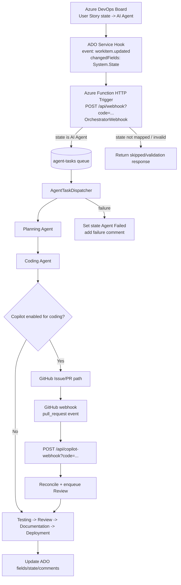

# Troubleshooting Guide

Comprehensive diagnostic and resolution guide for the ADOm8 system. This guide covers common failure scenarios, diagnosis steps, and emergency procedures.

---

## Quick Diagnostics

### 1. Check System Health

```bash
# Hit the health endpoint
curl https://<function-app>.azurewebsites.net/api/health | jq .

# Or check the dashboard
# Navigate to your Static Web App URL → System Health panel
```

**Healthy response:**
```json
{
  "status": "Healthy",
  "checks": {
    "azureDevOps": { "status": "Healthy", "responseTime": "245ms" },
    "storageQueue": { "status": "Healthy", "messageCount": 2, "poisonMessageCount": 0 },
    "aiApi": { "status": "Healthy", "responseTime": "890ms" },
    "configuration": { "status": "Healthy" },
    "gitConfiguration": { "status": "Healthy" }
  }
}
```

### 2. Check Application Insights

```kusto
// Recent errors (last 1 hour)
exceptions
| where timestamp > ago(1h)
| order by timestamp desc

// Agent execution summary
customEvents
| where name in ("AgentCompleted", "AgentFailed", "AgentPermanentFailure")
| where timestamp > ago(24h)
| summarize count() by name, bin(timestamp, 1h)
| render timechart

// Dead letter queue activity
customEvents
| where name == "DeadLetterProcessed"
| where timestamp > ago(24h)
| order by timestamp desc
```

### 3. Check Queue Status

```bash
# Check main queue depth
az storage message peek --queue-name agent-tasks \
  --account-name <storage-account> --num-messages 32

# Check poison/dead-letter queue
az storage message peek --queue-name agent-tasks-poison \
  --account-name <storage-account> --num-messages 32
```

### 4. Run Function Smoke Harness (Fast Contract Check)

```bash
# Validates health, status, ADO webhook, and GitHub webhook guardrails
pwsh ./scripts/function-smoke/run-function-smoke.ps1 \
  -FunctionAppUrl "https://<function-app>.azurewebsites.net" \
  -FunctionKey "<function-key>"
```

Use this before and after any process/service-hook change.

---

## Webhook Flow (Current)

When a story is moved to **AI Agent**, Azure DevOps should emit a `workitem.updated` service-hook event that hits the Function webhook endpoint.



### AI Agent Trigger Checklist (2-minute runbook)

1. **Service hook delivery**
   - Azure DevOps → Project Settings → Service Hooks → open the subscription.
   - Verify recent delivery entries exist when state moved to `AI Agent`.
   - Confirm destination response is HTTP `200`.

2. **Subscription target URL**
   - Must be: `https://<function-app>.azurewebsites.net/api/webhook?code=<function-key>`
   - Route `/api/OrchestratorWebhook` is legacy and should not be used.

3. **Subscription filters**
   - Event type: `workitem.updated`
   - Work item type: `User Story`
   - Changed field filter includes `System.State`
   - Project filter points to the intended project

4. **Queue handoff**
   - After delivery, verify message appears in `agent-tasks` queue.
   - If webhook succeeded but queue is empty, inspect function logs for validation failures.

5. **Dispatcher outcome**
   - Verify `AgentTaskDispatcher` invocation.
   - On failures, story should move to `Agent Failed` with a comment.

6. **GitHub bridge (if Copilot path used)**
   - Confirm `copilot-webhook` receives PR events with valid signature.
   - If no PR event arrives, review GitHub webhook delivery logs.

---

## Common Issues

### Optional Fine-Tuning: Copilot Checkpoint Enforcement

Use this only if you want to override defaults for Copilot completion handoff enforcement.

Default behavior (already set in `adom8-onboarding-pipeline.yml`):
- `COPILOT_CHECKPOINT_ENFORCEMENT_ENABLED=true`
- `COPILOT_CHECKPOINT_FAIL_HARD=true`
- `COPILOT_REQUIRED_ADO_CHECKPOINTS=LastAgent,CurrentAIAgent,CompletionComment`

What these controls do:
- `COPILOT_CHECKPOINT_ENFORCEMENT_ENABLED`: verifies required Azure DevOps updates before Review is enqueued.
- `COPILOT_CHECKPOINT_FAIL_HARD`: blocks pipeline progression when required updates are missing.
- `COPILOT_REQUIRED_ADO_CHECKPOINTS`: supported values are `LastAgent`, `CurrentAIAgent`, `CompletionComment`.

When to set in pipeline UI Variables:
- Only when you need non-default behavior for a specific environment.
- If you keep defaults, you do not need to add these variables manually.

### Issue 1: Work Items Not Being Picked Up

**Symptoms:**
- Work item state changes in Azure DevOps but nothing happens
- No entries in Application Insights
- Queue stays empty

**Diagnosis:**

```kusto
// Check if webhook received the event
requests
| where name == "OrchestratorWebhook"
| where timestamp > ago(1h)
| order by timestamp desc
```

**Solutions:**

1. **Service Hook not configured:**
   - Go to Azure DevOps → Project Settings → Service Hooks
   - Verify a Web Hook exists pointing to `https://<function-app>.azurewebsites.net/api/webhook?code=<function-key>`
   - Trigger: Work Item Updated, State field changes

2. **Wrong state transition:**
   - Webhook dispatch triggers when new state is `AI Agent`
   - Downstream stages are controlled by `Current AI Agent` and queue orchestration
   - Verify your work item type is `User Story` and the state matches exactly

3. **Function app not running:**
   ```bash
   az functionapp show --name <function-app> --resource-group <rg> --query "state"
   ```

4. **Input validation rejected the work item:**
   - Check the work item's Discussion tab for validation error comments posted by the system
   - Fix the title/description issues noted in the comment

---

### Issue 2: Agent Fails Repeatedly (Transient Errors)

**Symptoms:**
- Agent starts but fails, then retries
- `AgentFailed` events in Application Insights with `errorCategory: Transient`
- Messages eventually move to poison queue after 5 retries

**Diagnosis:**

```kusto
// Find transient failures
customEvents
| where name == "AgentFailed"
| where customDimensions.errorCategory == "Transient"
| where timestamp > ago(6h)
| project timestamp, workItemId = customDimensions.workItemId,
          agent = customDimensions.agentType,
          error = customDimensions.errorMessage
| order by timestamp desc
```

**Solutions:**

1. **AI API rate limiting (429):**
   - Wait for rate limit to reset (usually 1-60 seconds)
   - The queue retry mechanism handles this automatically (up to 5 retries with exponential backoff)
   - If persistent: check your API plan limits, consider upgrading

2. **AI API temporary outage:**
   - Check provider status: [Anthropic Status](https://status.anthropic.com/) | [OpenAI Status](https://status.openai.com/)
   - The circuit breaker will trip after 80% failure rate (5+ requests), pausing calls for 30 seconds

3. **Network timeout:**
   - Check function app region vs. AI API region
   - Azure Function timeout is 10 minutes (Consumption plan)

---

### Issue 3: Agent Fails Permanently (Configuration Errors)

**Symptoms:**

---

### Issue 4: Coding Agent Appears Stuck After Copilot Finishes

**Symptoms:**
- Story remains on `Coding Agent` in dashboard even though Copilot posted/updated a PR
- PR may stay Draft for a while
- No follow-on transition to Review is observed

**Current mechanism (important):**
- Coding delegation pauses until `CopilotBridgeWebhook` reconciles a GitHub PR.
- Bridge listens to `pull_request` events and resumes pipeline after readiness conditions are met.
- `ready_for_review` action is treated as sufficient to reconcile and continue.
- For other PR actions, bridge still uses readiness heuristics.
- Timeout checker is a safety net and **does not** auto-resume pipeline; it marks timeout and waits for explicit resume.

**Checks:**
1. In GitHub webhook deliveries, verify `pull_request` events are arriving at `/api/copilot-webhook` with HTTP `200`.
2. Confirm webhook secret matches the Function App `Copilot__WebhookSecret` value.
3. Confirm PR includes `US-<id>` in title/body so bridge can map it to the delegation.
4. Confirm branch naming still matches expected `feature/US-<id>` conventions.

**Recovery options:**
1. If PR is complete, mark it `Ready for review` (or re-trigger a `pull_request` update event).
2. If webhook was missed, call `POST /api/resume` with stage `Review` to continue pipeline.
3. If delegation timed out, resume explicitly (`/api/resume`) rather than waiting for auto-fallback.
- Agent fails immediately without retry
- `AgentPermanentFailure` events in Application Insights
- Work item state set to "Agent Failed"
- Error comment posted to work item Discussion

**Diagnosis:**

```kusto
customEvents
| where name == "AgentPermanentFailure"
| where timestamp > ago(24h)
| project timestamp, workItemId = customDimensions.workItemId,
          agent = customDimensions.agentType,
          category = customDimensions.errorCategory,
          error = customDimensions.errorMessage
```

**Solutions:**

1. **Invalid API key (401 Unauthorized):**
   ```bash
   # Check current API key setting
   az functionapp config appsettings list --name <function-app> --resource-group <rg> \
     --query "[?name=='AI__ApiKey'].value" -o tsv
   
   # Update API key
   az functionapp config appsettings set --name <function-app> --resource-group <rg> \
     --settings "AI__ApiKey=NEW_KEY"
   ```

2. **Invalid Azure DevOps PAT:**
   ```bash
   # Test PAT manually
   curl -u :YOUR_PAT "https://dev.azure.com/yourorg/_apis/projects?api-version=7.0"
   
   # Update PAT
   az functionapp config appsettings set --name <function-app> --resource-group <rg> \
     --settings "AzureDevOps__Pat=NEW_PAT"
   ```

3. **Data validation error (bad work item content):**
   - Read the error comment on the work item's Discussion tab
   - Common issues: title too long, prompt injection detected, excessive special characters
   - Fix the work item content, then re-trigger by changing state

---

### Issue 4: Dead Letter Queue (Poison Messages) Growing

**Symptoms:**
- `agent-tasks-poison` queue has messages
- `DeadLetterProcessed` events in Application Insights
- Work items stuck with "Agent Failed" state

**Diagnosis:**

```bash
# Count poison messages
az storage message peek --queue-name agent-tasks-poison \
  --account-name <storage-account> --num-messages 32 --query "length(@)"

# View poison message content
az storage message peek --queue-name agent-tasks-poison \
  --account-name <storage-account> --num-messages 1
```

```kusto
// Dead letter processing history
customEvents
| where name == "DeadLetterProcessed"
| where timestamp > ago(7d)
| project timestamp, workItemId = customDimensions.workItemId,
          agent = customDimensions.agentType,
          error = customDimensions.errorMessage
| order by timestamp desc
```

**Solutions:**

1. **Identify root cause:** The DLQ handler runs every 15 minutes and posts failure comments to work items. Check the work item Discussion tab.

2. **Re-process after fixing:** Once the root cause is fixed (API key, config, etc.), change the work item state back to the appropriate agent state to re-trigger processing.

3. **Clear poison queue (if stale):**
   ```bash
   az storage message clear --queue-name agent-tasks-poison \
     --account-name <storage-account>
   ```

---

### Issue 5: Health Check Reports Unhealthy

**Symptoms:**
- `/api/health` returns HTTP 503
- Dashboard shows red status indicators
- One or more component checks failing

**Diagnosis:**

```bash
curl -s https://<function-app>.azurewebsites.net/api/health | jq '.checks'
```

**Solutions by component:**

| Component | Status | Common Fix |
|-----------|--------|------------|
| `azureDevOps` | Unhealthy | PAT expired → regenerate and update `AzureDevOps__Pat` |
| `storageQueue` | Unhealthy | Storage account connectivity → check firewall rules |
| `aiApi` | Unhealthy | API key invalid or provider down → check key, check status page |
| `configuration` | Degraded | Missing env vars → check `AI__ApiKey`, `AzureDevOps__Pat`, `Git__Token` |
| `gitConfiguration` | Degraded | Missing Git settings → set `Git__RepositoryUrl`, `Git__Username`, `Git__Email` |

---

### Issue 6: Circuit Breaker Tripped

**Symptoms:**
- All AI API calls failing immediately (not even attempting)
- Errors mention "circuit breaker" or "BrokenCircuit"
- Resolves automatically after 30 seconds

**Diagnosis:**

```kusto
customEvents
| where name == "CircuitBreakerTripped"
| where timestamp > ago(1h)
| order by timestamp desc
```

**Explanation:**

The circuit breaker protects against cascading failures. It trips when:
- **Failure ratio** exceeds 80% of requests
- Over a **60-second sampling window**
- With at least **5 requests** in that window

Once tripped, all AI API calls are blocked for **30 seconds** to let the provider recover.

**Solutions:**

1. **Wait 30 seconds** — the circuit breaker resets automatically
2. **If persistent:** Check AI provider status page for outages
3. **Adjust thresholds** if too sensitive (in `Program.cs`):
   ```csharp
   options.CircuitBreaker.FailureRatio = 0.8;      // 80% failure rate
   options.CircuitBreaker.MinimumThroughput = 5;    // Min 5 requests
   options.CircuitBreaker.BreakDuration = TimeSpan.FromSeconds(30);
   ```

---

### Issue 7: Input Validation Rejecting Valid Work Items

**Symptoms:**
- Work items rejected before agent processing starts
- Validation error comments posted to work item Discussion
- `InputValidationFailed` events in Application Insights

**Diagnosis:**

```kusto
customEvents
| where name in ("InputValidationFailed", "InputValidationWarning")
| where timestamp > ago(24h)
| project timestamp, workItemId = customDimensions.workItemId,
          errors = customDimensions.errors
| order by timestamp desc
```

**Solutions:**

1. **Title too long (>255 chars):** Shorten the work item title
2. **Description too long (>10000 chars):** Summarize or split into multiple stories
3. **Prompt injection detected:** Remove phrases like "ignore previous instructions" or "system:" from content (false positive protection may be too aggressive — see point 4)
4. **Disable strict mode** for looser validation:
   ```json
   // In Function App settings or local.settings.json
   "InputValidation__StrictMode": "false"
   ```
5. **Adjust limits** via configuration:
   ```json
   "InputValidation__MaxTitleLength": "500",
   "InputValidation__MaxDescriptionLength": "20000",
   "InputValidation__EnablePromptInjectionDetection": "false"
   ```

---

### Issue 8: Token Usage / Cost Unexpectedly High

**Symptoms:**
- High AI API bills
- Large token counts in Application Insights
- Cost tracking shows spending above budget

**Diagnosis:**

```kusto
// Token usage by agent over last 7 days
customEvents
| where name == "TokensUsed"
| where timestamp > ago(7d)
| extend agent = tostring(customDimensions.agentType),
         inputTokens = toint(customDimensions.tokensInput),
         outputTokens = toint(customDimensions.tokensOutput)
| summarize totalInput = sum(inputTokens),
            totalOutput = sum(outputTokens)
            by agent
| order by totalInput desc

// Cost per story
customEvents
| where name == "CostIncurred"
| where timestamp > ago(30d)
| extend cost = todouble(customDimensions.cost),
         workItemId = tostring(customDimensions.workItemId)
| summarize totalCost = sum(cost) by workItemId
| order by totalCost desc
```

**Solutions:**

1. **Set per-story cost budget:**
   ```json
   "InputValidation__MaxCostPerStory": "5.00"
   ```

2. **Reduce max tokens:**
   ```json
   "AI__MaxTokens": "2048"
   ```

3. **Use cheaper models for non-critical agents:**
   ```json
   "AI__AgentModels__Testing__Model": "gpt-4o-mini",
   "AI__AgentModels__Documentation__Model": "gemini-2.0-flash"
   ```

4. **Set per-story model overrides for costly stories:**
   Set `AI Model Tier = "Economy"` on low-priority stories to use cheaper models across the board, or set individual agent model fields (e.g., `AI Coding Model = "gpt-4o-mini"`) for granular control.

5. **Lower autonomy level** to avoid auto-processing:
   Set stories to Autonomy Level 1 (Plan Only) or 2 (Code + Review)

---

## Emergency Procedures

### Stop All Agent Processing

```bash
# Option 1: Stop the Function App
az functionapp stop --name <function-app> --resource-group <rg>

# Option 2: Disable the queue trigger (keeps HTTP functions running)
az functionapp config appsettings set --name <function-app> --resource-group <rg> \
  --settings "AzureWebJobs.AgentTaskDispatcher.Disabled=true"

# Resume processing
az functionapp start --name <function-app> --resource-group <rg>
# Or re-enable: "AzureWebJobs.AgentTaskDispatcher.Disabled=false"
```

### Clear All Queued Work

```bash
# Clear main queue
az storage message clear --queue-name agent-tasks --account-name <storage-account>

# Clear poison queue
az storage message clear --queue-name agent-tasks-poison --account-name <storage-account>
```

### Rotate Compromised Credentials

```bash
# 1. Generate new credentials from respective providers

# 2. Update all at once
az functionapp config appsettings set --name <function-app> --resource-group <rg> \
  --settings \
    "AI__ApiKey=NEW_AI_KEY" \
    "AzureDevOps__Pat=NEW_ADO_PAT" \
    "Git__Token=NEW_GIT_TOKEN"

# 3. Restart the function app to pick up changes
az functionapp restart --name <function-app> --resource-group <rg>
```

### Force-Reset a Stuck Work Item

If a work item is stuck in a processing state:

1. Open the work item in Azure DevOps
2. Change state to `New` or the desired starting state
3. Wait for agents to re-process (or set Autonomy Level 0 to prevent re-processing)

---

## Preventive Maintenance

### Weekly Checks

- [ ] Review Application Insights for error trends
- [ ] Check dead letter queue count (should be 0)
- [ ] Verify health endpoint returns Healthy
- [ ] Review token usage / cost trends
- [ ] Check Azure DevOps PAT expiration date

### Monthly Checks

- [ ] Rotate API keys and PATs
- [ ] Review and clean up old `.ado/stories/` directories
- [ ] Update AI model versions if newer available
- [ ] Review circuit breaker / retry configuration
- [ ] Check Terraform state for drift: `terraform plan`

---

## Getting Help

For shared-org setups with multiple projects, review: **[Project Isolation Checklist](PROJECT_ISOLATION_CHECKLIST.md)**.

1. **Check this guide** — most issues are covered above
2. **Review Application Insights** — search `exceptions` and `customEvents` tables
3. **Check the health endpoint** — `/api/health` gives component-level status
4. **Review the dashboard** — visual overview of system state
5. **Check the `.planning/` directory** — architecture decisions and session logs
6. **Open a GitHub issue** — include health check output and relevant App Insights queries
